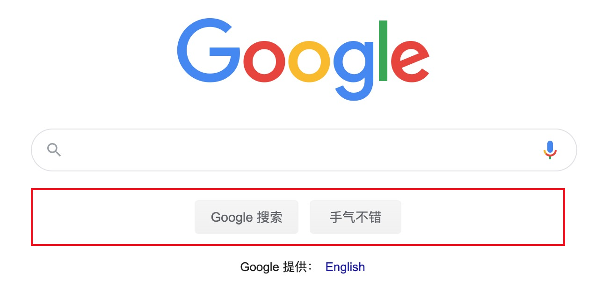
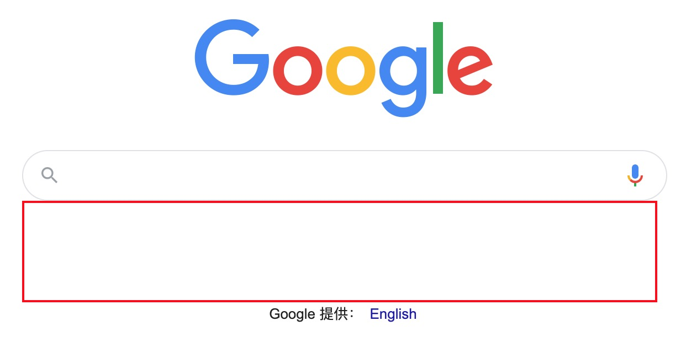
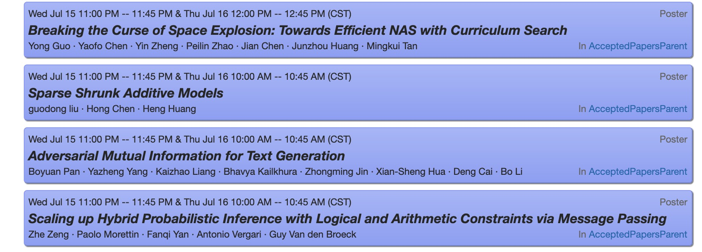
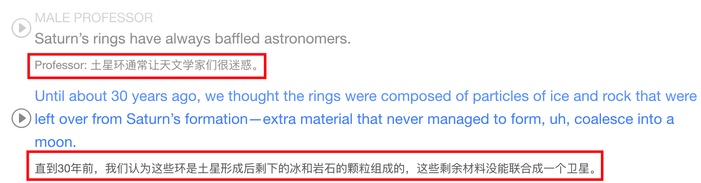

# My Chrome Plugins

## element_detect_delete.zip
- Detecting and Deleting HTML elements
- Highlights the DOM element while the cursor moves on it; double-click or right-click will delete current DOM element.
- 
- 

## cc_prevent_redirect.zip
- neurips.cc、icml.cc、iclr.cc
- Prevents current page(papers list) from automatically redirecting to detail page when you click or copy the paper title on these sites
  - e.g. https://icml.cc/Conferences/2019/Schedule?type=Poster 
- 

## kaomanfen_show_zh_explanations.zip
- KaoManFen website, show all CN explanations for listening individually.
- 

